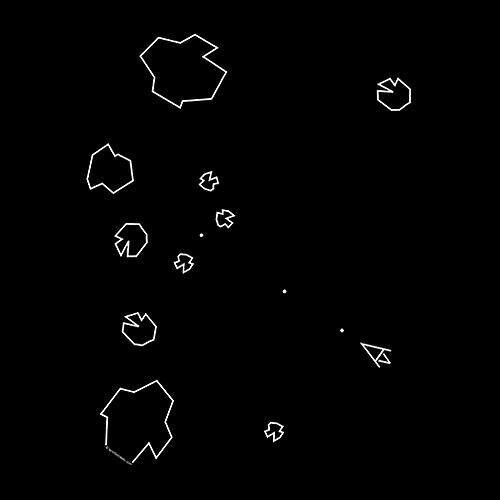

# Asteroid game written in Rust and raylib
\
Based on the 1979 arcade game Asteroid and [jdh](https://github.com/jadh)'s Zig implementation 

## Running
Requires the Rust toolchain.
```bash
git clone https://github.com/mac-op/asteroid-rs.git
cd asteroid-rs
cargo run
```
-----------------------------------
\
